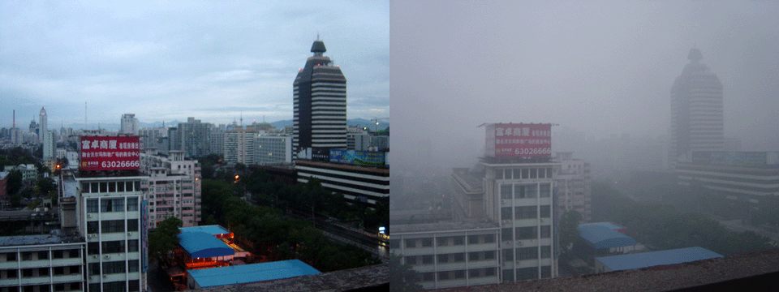

](1024px-AB_Schwh_HolzH.JPG)

![von Ajzh2074 (Eigenes Werk) [CC BY-SA 3.0 (http://creativecommons.org/licenses/by-sa/3.0)], via Wikimedia Commons](PM10cabellohumano.png)

](PPD_DHT_deployed_BirkachMitteStra.jpg)

https://upload.wikimedia.org/wikipedia/commons/0/06/Motorrad_aus_Zusatzzeichen_1046-12.svg
von Purodha Blissenbach (extracted from: Image:Zusatzzeichen_1046-12.svg) [Public domain, Public domain oder Public domain], via Wikimedia Commons

https://upload.wikimedia.org/wikipedia/commons/a/a4/PKW_aus_Zusatzzeichen_1048-10.svg
von Purodha Blissenbach (extracted from: Image:Zusatzzeichen_1048-10.svg) [Public domain, Public domain oder Public domain], via Wikimedia Commons

https://commons.wikimedia.org/wiki/File:Flygplanspiktogram.svg?uselang=de
von Reaperman (SVG picture), E70 (original GIF picture) (own svg redrawing of Image:Flygplanspiktogram.GIF) [GFDL (http://www.gnu.org/copyleft/fdl.html) oder CC-BY-SA-3.0 (http://creativecommons.org/licenses/by-sa/3.0/)], via Wikimedia Commons

https://upload.wikimedia.org/wikipedia/commons/9/9a/Sinnbild_Radfahrer.svg
This image is in the public domain according to German copyright law because it is part of a statute, ordinance, official decree or judgment (official work) issued by a German federal or state authority or court (§ 5 Abs.1 UrhG).

https://openclipart.org/download/2636/Pommi-Traffic-Sign.svg
by Pommi, public domain

https://openclipart.org/detail/216059/simple-house
by worker, public domain

https://upload.wikimedia.org/wikipedia/commons/3/33/Dining_cryptographers_protocol%2C_network_graph%2C_Japanese.svg?uselang=de
Author  User:Cocoa_ruto
Licensing[edit]
   I, the copyright holder of this work, release this work into the public domain. This applies worldwide.
In some countries this may not be legally possible; if so:
I grant anyone the right to use this work for any purpose, without any conditions, unless such conditions are required by law.
<!--
-->
