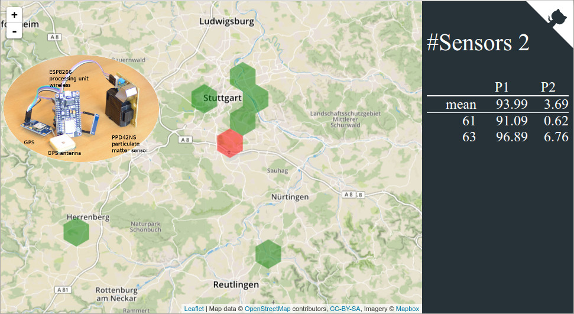

# Particulate matter sensor network

* Challenge: [Aircheck](https://2016.spaceappschallenge.org/challenges/earth/aircheck)

* This project is now available/online: https://2016.spaceappschallenge.org/challenges/earth/aircheck/projects/particulate-matter-sensor-network

<!--CREATE YOUR PROJECT SOLUTION

in response to
Aircheck
GENERAL INFORMATION-->

## SOLUTION TITLE

Particulate matter sensor network

<!--Our Great Solution...-->

## SOLUTION VIDEO

https://youtu.be/a_cEQHYuSfs
https://www.youtube.com/watch?v=a_cEQHYuSfs

Long version (Sunday 1800):
https://www.youtube.com/watch?v=tez2J-pFUZU

TBD, use the [presentation partmattsensnet_in_30sec.html](./partmattsensnet_in_30sec.html).

<!--
https://www.youtube.com/watch?v=WZbuZT__twE
-->

## FEATURE IMAGE

<!-- Datei auswählen--> 

## PROJECT SPECIFICS

<!--EXPLAIN YOUR SOLUTION-->

# Introduction

Air pollution is a problem in cities all around the globe. 
Emissions from traffic, buildings, industry and various other sources can have adverse health effects.
Nowaday, many countries are actively trying to counter such problems with regulations.
An important step for counter-measures is the measurement of the actual air quality.
For example, the European Union developed measurement protocols and thresholds, which should not be exceeded and where actions have to be taken by the governments.

One of the monitored pollutants is particulate matter: small particles that are taken up while breathing and have the ability to permeate into the bodies. 
The measurement and monitoring of such particles is usually done only at a few sites within the city, and there are significant delays until the measurement data is available publicly (implied by the official measurement protocol). 

In Stuttgart, the station Neckartor exhibits the highest measured concentrations within Germany.

Therefore a citizen science project was created to build up a sensor network for PM measurements.
The sensors are maintained by citizens at locations within and around the city.
Hardware for the sensors has been selected and software was written to distribute and monitor the measurements within the network.
Currently the sensors are mounted at fixed locations and the data is gathered in a central database. 

## Goals and ideas

Within the challenge, two new components will be developed:
    
* **Mobile sensor**: A GPS sensor will be added for measurements on-the-go
* **Visualisation**: A map based visualisation of the most recent measurements

Additionally, the following topics could be of interest: 

* identify and add existing air quality data from external sources
* visualize the track data on a map, too

# Implementation

## Mobile sensor

* add GPS to existing sensor setup, see [commit](https://github.com/opendata-stuttgart/sensors-software/commit/58ff3fc409eb353f7f1e25051d55f153be9601b7)
* enable push GPS data to Django API (changes for GPS measurements see [commit](https://github.com/opendata-stuttgart/feinstaub-api/commit/6b0a1d20685b5e9dd3dcb351e9b0b8860465e8df)) and/or via MQTT

## Visualisation

This map visualisation was hacked during the NASA Space-Apps challenge 2016
https://2016.spaceappschallenge.org/locations/stuttgart-germany

The necessary steps were:

* adapt the django API: request to get the latest measurement values
* create a map visualisation based on the API inputs

Repository is located at <https://github.com/opendata-stuttgart/feinstaub-map>

### Django API changes

mfa provided the changes to the API (see [commit](https://github.com/opendata-stuttgart/feinstaub-api/commit/3ebbce1b70d6454ff1371112fe14385c3d475b4b))

### Map application

The map background is based on [OpenStreetMap](http://openstreetmap.org/) provided via [mapbox](https://www.mapbox.com/).
The application itself was created in JavaScript on top of a [leaflet](http://leafletjs.com/) layer.

The implemetation makes use of various frameworks and is on ECMA6 language level.

<!-- Used frameworks are:

* [leaflet](http://leafletjs.com/) (mapping framework)
* [d3](https://d3js.org/)
* [lodash](https://lodash.com/) (map, reduce, reorder data sets)
* [vue](http://vuejs.org/)
* [webpack](https://webpack.github.io/) is used for deployment
-->

## RESOURCES USED

* GPS sensor
* Particulate matter sensor device

Used frameworks for the map visualisation are:

* [leaflet](http://leafletjs.com/) (mapping framework)
* [d3](https://d3js.org/)
* [lodash](https://lodash.com/) (map, reduce, reorder data sets)
* [vue](http://vuejs.org/)
* [webpack](https://webpack.github.io/) is used for deployment

## SOLUTION URL

https://github.com/opendata-stuttgart/feinstaub-map
<!--https://github.com/nasa/space-apps.git-->


## TEAM

Martin and rashfael
